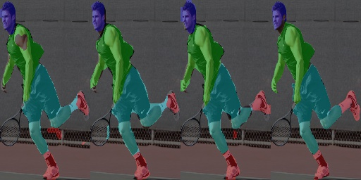

# Human Parsing for Reid
Human Parsing for Reid : human parsing networks trained on Look into Person dataset.
LIP dataset has 20 body parts,while in this project we merge those 20 parts into 5 parts:
 background, head, upper-body, lower-body, shoes. 

# Version
torch0.4.1

torchvision0.2.1

# Networks
We support Deeplabv2, EDAnet, Tiny-FCN-4s, BiSeNet, Enet, ESPnet, Enet.
Weights for Deeplabv2, EDAnet, Tiny-FCN-4s are available.

#### Look into Person
| Model |  meanIOU( 5 parts) |Parameters(MB)|Download(code 61ww)|
| --- | :---: | :---: |   :---: | 
| Deeplabv2 | 67.92%|  42.76 | [model](https://pan.baidu.com/s/1qb6UOpAItqkECZ4kf7pbjg) |
| EDAnet | 65.42% |  0.68 |[model](https://pan.baidu.com/s/1qb6UOpAItqkECZ4kf7pbjg) |
|Tiny-FCN-4s|65.21% |  0.71 | [model](https://pan.baidu.com/s/1qb6UOpAItqkECZ4kf7pbjg) |

## Demo
from left to right :  tiny-FCN-4s, EDAnet, deeplabv2-res101, ground truth

##  How to use
Test on your on images: test.py

Train your network: train_uni.py

Prepare 4 parts datasets and show overlaps: /preprocess